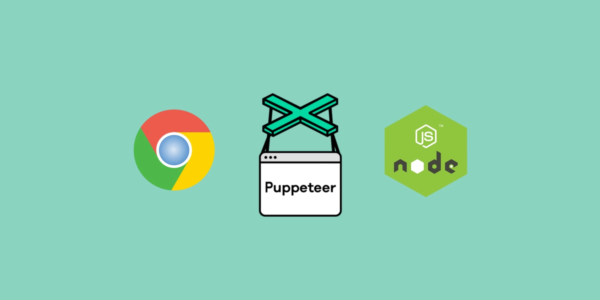

**DNS SHOP parsing videocard**

**Описание:**

Код 100% рабочий.

Парсинг с помощью *puppeteer* + *node.js*

Спарсит видеокарты с сайта <a href="https://dns-shop.ru">dns-shop.ru</a> и сохранит их в *json* фаил.

**Для работы вам потребуется:**

1) Скачать и установить LTS версию <a href="https://nodejs.org/en/download/">Node.Js</a>
2) Открываем терминал (PowerShell) или Командную строку(CMD)
3) Создаём папку командой <code>mkdir dns_shop_parser</code>
4) В папке *dns_shop_parser* создаём *пакет json* командой <code>npm i -y</code>
5) Устанавливаем *Puppeteer* командой <code>npm i puppeteer</code>
6) Скачиваем себе файл *index.js* или копируем код.
7) Запускаем файл *index.js* у вас должен открыться браузер и создаться файл *dns-shop.json*